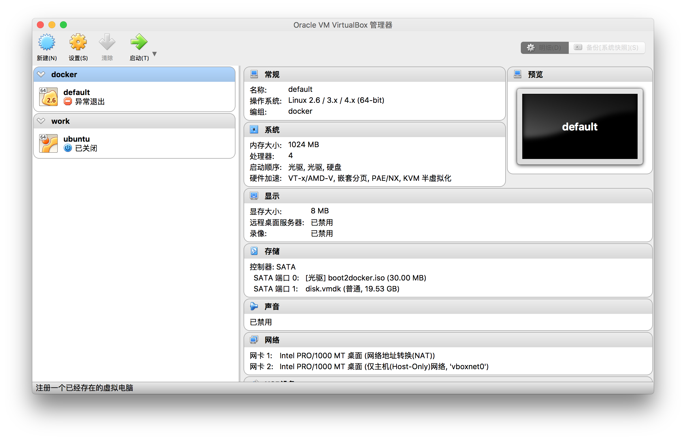
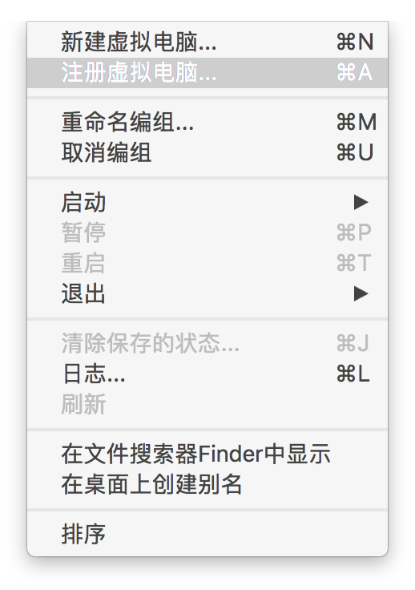
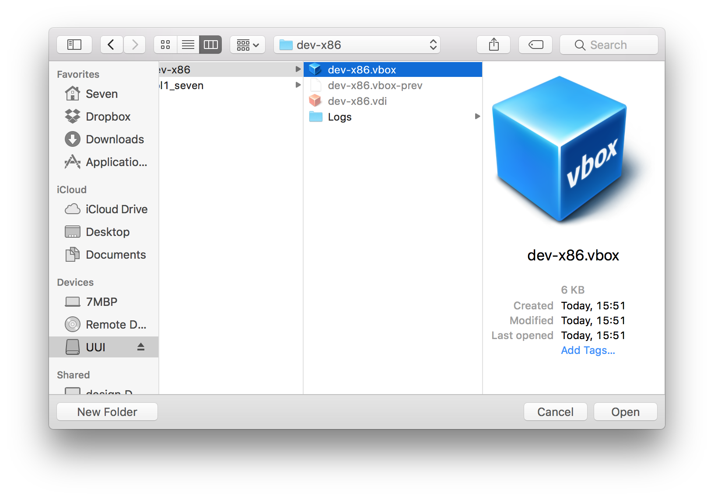
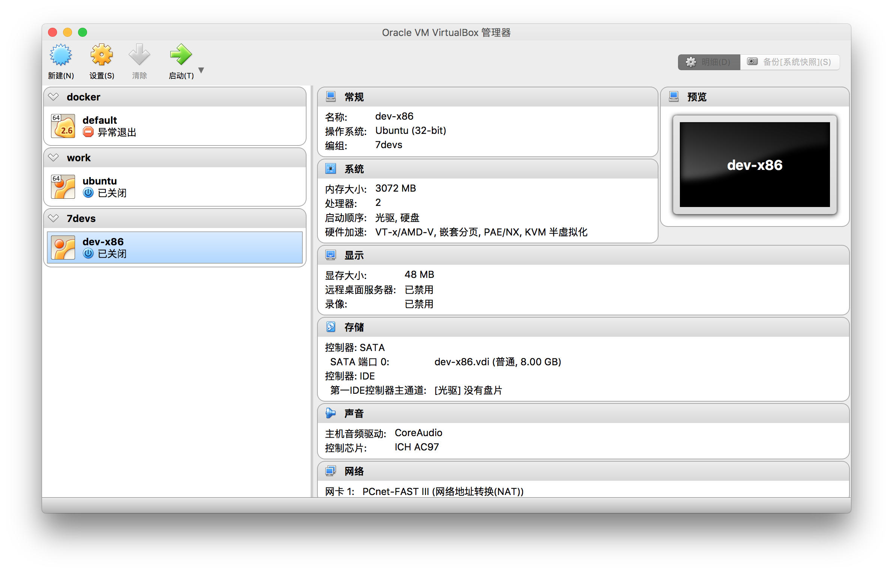

# vol 1 @Seven

## 一些参考文档在线资源

- [JavaScript 教程](http://www.w3school.com.cn/js/index.asp)
- [Node 入门](http://www.nodebeginner.org/index-zh-cn.html)
- [Node.js 包教不包会](https://github.com/alsotang/node-lessons)
- [JSON 文档](http://json.org/)
- [Node.js 文档](https://nodejs.org/dist/latest-v6.x/docs/api/)
- [Express 文档](http://expressjs.com/en/4x/api.html)
- [微信开发文档](https://mp.weixin.qq.com/wiki)
- [微信 UI 库](https://github.com/weui/weui)
- [Git 文档](https://git-scm.com/book/zh/v2)
- [阮一峰博客 (扩展阅读)](http://www.ruanyifeng.com/)
  - [HTTP 协议入门](http://www.ruanyifeng.com/blog/2016/08/http.html)
  - [Git 常用命令清单](http://www.ruanyifeng.com/blog/2015/12/git-cheat-sheet.html)
  - [理解 RESTful 架构](http://www.ruanyifeng.com/blog/2011/09/restful.html)

## 工具下载

- [VirtualBox 虚拟机](https://www.virtualbox.org)
  - [VirtualBox platform packages](https://www.virtualbox.org/wiki/Downloads)
  - [VirtualBox 5.1.4 Oracle VM VirtualBox Extension Pack](http://download.virtualbox.org/virtualbox/5.1.4/Oracle_VM_VirtualBox_Extension_Pack-5.1.4-110228.vbox-extpack)
- [Atom 编辑器](https://atom.io)
  - [Downloads](https://github.com/atom/atom/releases/)

## 注册虚拟机

