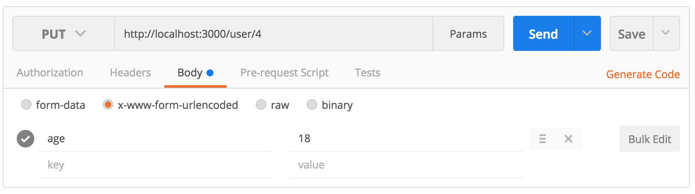
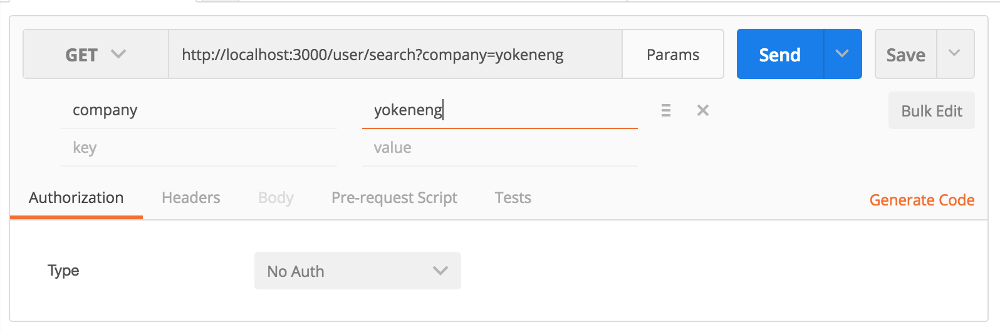
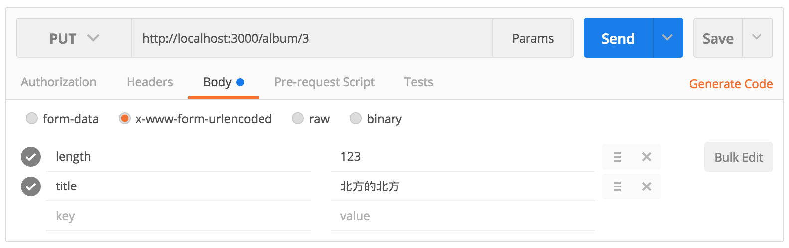
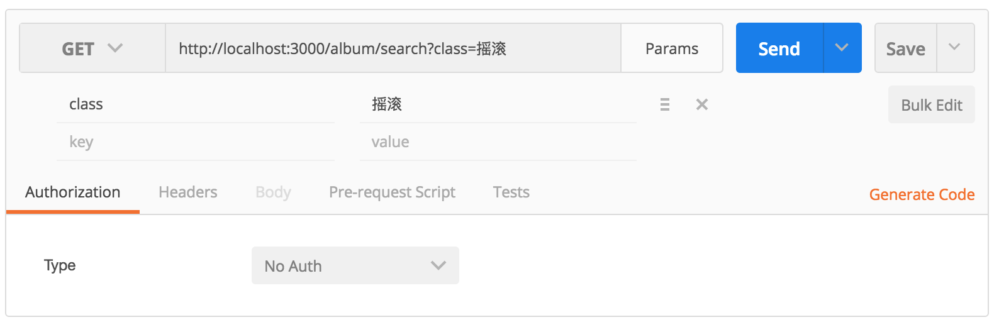

# Node.js web 服务搭建作业

1. 创建新项目
    1. 新建项目文件夹
    1. 初始化项目
    1. 安装 express 包
    1. 安装 body-parser 包
    1. 创建入口文件
1. 框架搭建
    1. 编辑入口文件（包引入，路由表，监听）
    1. 创建对应文件夹，copy 提供的 model 文件到对应目录
    1. 编写路由
1. 业务逻辑（路由）
    1. 用户 `/user`
        - `GET`      `/`                       返回全部用户
        - `GET`      `/:id`                    获取指定索引用户的全名（firstName + lastName）
            - 若用户不存在，返回状态码为 404 的 Not Found 信息
        - `PUT`      `/:id`                    修改指定索引用户的年龄并返回结果（key 为 age，参考 `图1`）
            - 若给定的年龄不是数值型，返回错误信息；
            - 若用户不存在，返回状态码为 404 的 Not Found 信息

            > **说明：**

            > `PUT` 方法和之前提到过的 `GET` `POST` `DELETE` 方法一样，也是 http 访问方法的一种，一般用来修改数据（后面课程会具体讲）

            > 该作业点要求，通过 ID 获取指定用户，得到某用户数据的 Object，形如：
            ```javascript
            {
                firstName: "Python",
                lastName: "Re",
                age: 12,
                sex: "male",
                company: "GeekPark Inc."
            }
            ```
            > 提交如 `图1` 中 body 数据

            > 将获取到的新的 age 值赋值给之前得到的 user 对象的 age 属性

            > 然后返回修改后的 user 对象
        - `GET`      `/count/:sex`             获取指定性别的人数统计（例: /user/count/male 返回 10）
        - `GET`      `/ageAvg`                 返回所有用户年龄平均值
        - `GET`      `/search?company=xxx`     搜索，返回公司名称包含搜索字符串的用户列表（忽略大小写，参考 `图2`）
            - 若未找到任何用户，返回状态码为 404 的 Not Found 信息
    1. 唱片 `/album`
        - `GET`      `/`                       返回全部唱片
        - `GET`      `/:id`                    返回指定索引的唱片数据
            - 若唱片不存在，返回状态码为 404 的 Not Found 信息
        - `PUT`      `/:id`                    修改指定索引唱片的时长和标题并返回结果（key 为 length 和 title，参考 `图3`）
            - 若唱片不存在，返回状态码为 404 的 Not Found 信息
        - `GET`      `/longerSong`             返回歌曲时间大于3分钟的歌曲
        - `GET`      `/singer/:name`           返回指定歌手的全部歌曲
            - 若唱片不存在，返回状态码为 404 的 Not Found 信息
        - `GET`      `/search?type=xxx`        获取指定分类下的歌曲列表（参考 `图4`)
            - 若分类不存在，返回状态码为 404 的 Not Found 信息
1. 测试
    - 在浏览器中访问所有路由表中 GET 方法的地址
    - 例如：
        - http://127.0.0.1:3000/user
        - http://127.0.0.1:3000/user/3
        - http://127.0.0.1:3000/user/count/male
        - http://127.0.0.1:3000/user/count/female
        - http://127.0.0.1:3000/user/ageAvg
        - http://127.0.0.1:3000/user/search?company=geek
        - http://127.0.0.1:3000/user/search?company=beijing
        - http://127.0.0.1:3000/album
        - http://127.0.0.1:3000/album/4
        - http://127.0.0.1:3000/album/longerSong
        - http://127.0.0.1:3000/album/singer/郑钧
        - http://127.0.0.1:3000/album/search?type=摇滚
        - http://127.0.0.1:3000/album/search?type=民谣
    - 在 Postman 中测试 PUT 接口
        - （参考 `图1` 和 `图3`）

_图1_

_图2_

_图3_

_图4_

