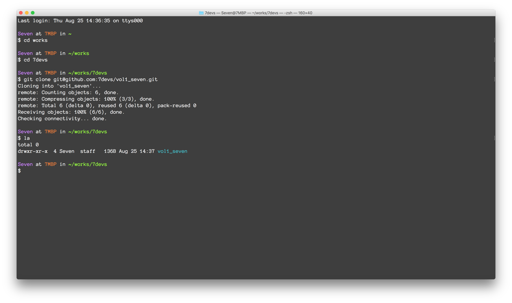
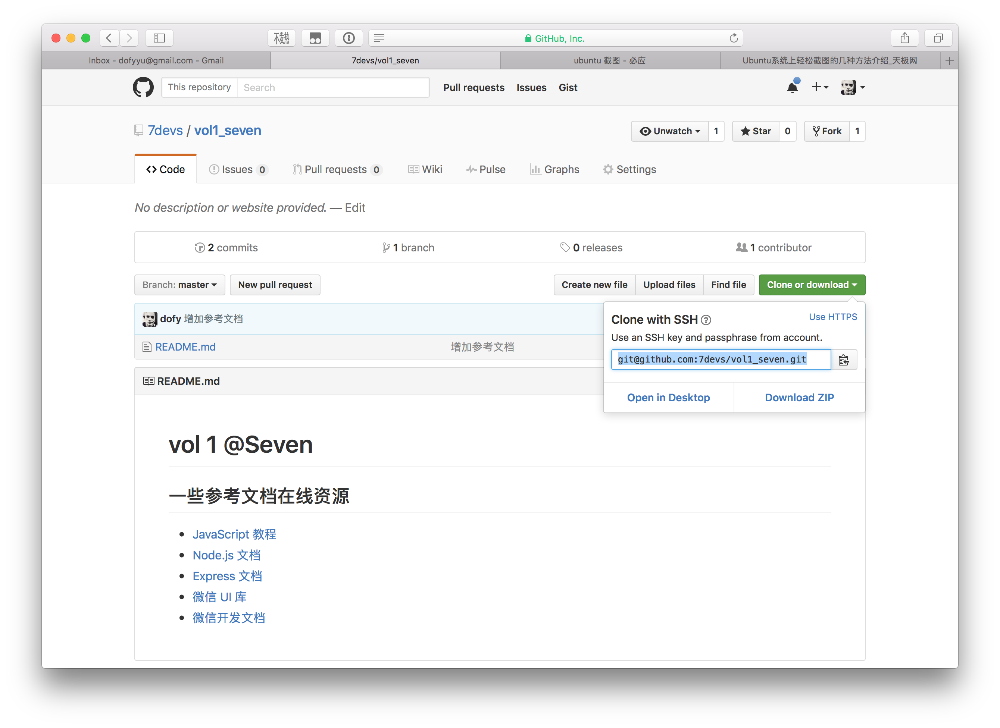
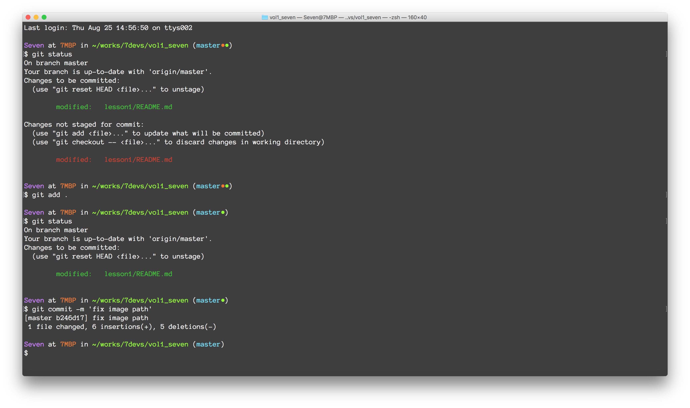
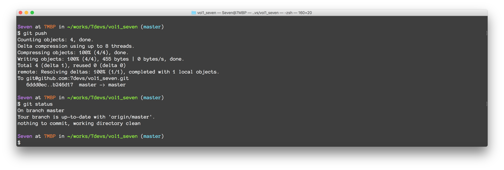
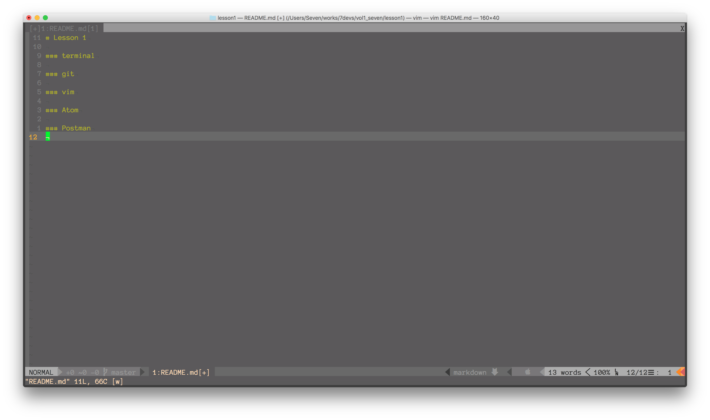
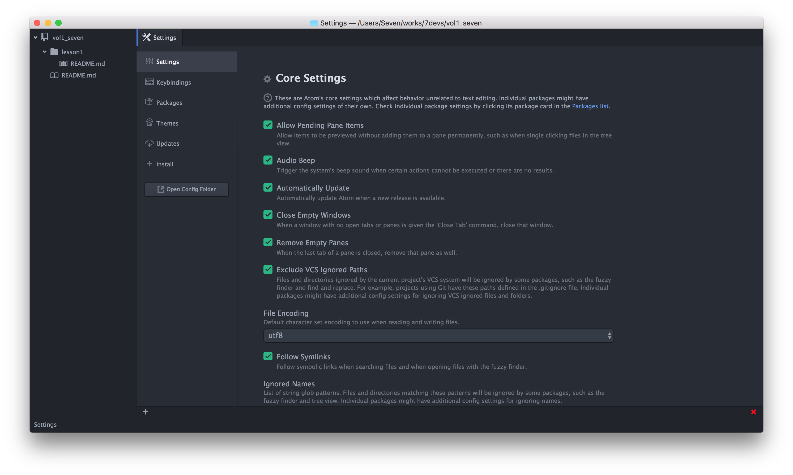
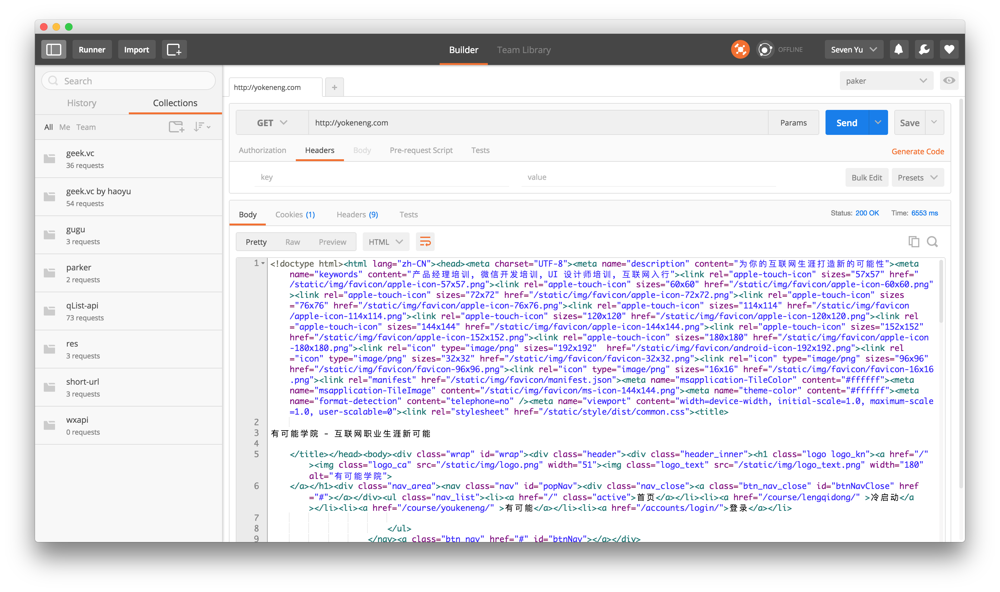

# Lesson 1

### terminal
```bash
#切换工作目录
cd works
#列出当前目录文件
la
```


### github & git

```bash
#克隆项目到本地
git clone git@github.com:7devs/vol1_seven.git
cd vol1_seven
#查看项目修改状态
git status
#添加修改文件
git add .
#提交修改本地仓库
git commit -m 'message'
#提交修改到远程仓库
git push
#拉取更新
git pull
```



### vim
```bash
#编辑（新建）文件
vim README.md
```


### Atom



### Postman

